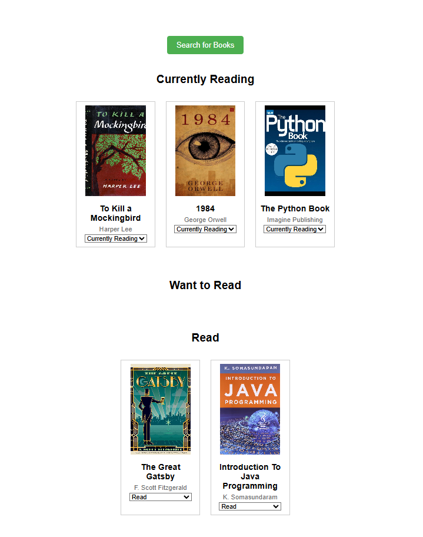
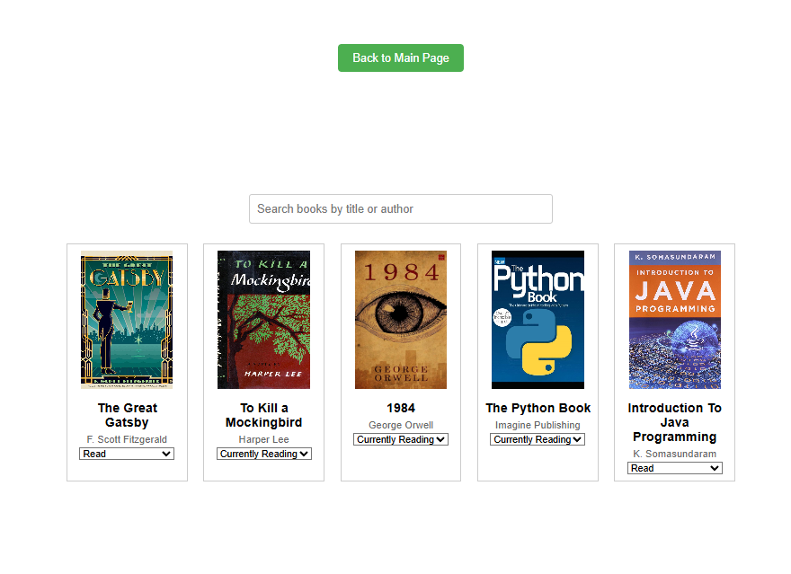

# MyReads App

### Description
A simple app that allows users to organize their books in categories.

### Features
- View books in different shelves based on their reading status (Currently Reading, Want to Read, Read).
- Search for books by title or author.
- Move books between shelves.
- The application saves your book data, so it persists even after a page refresh.

---

## Installation and Setup Instructions

### Prerequisites
To run this project locally, you need to have:
- **Node.js** installed (preferably the latest version).
- **npm** installed.

### Clone the repository:
git clone https://github.com/hazaaAlmarzooqi/simpleMyreads_ReactProject.git

cd myreads

### Install dependencies:
To install all the required dependencies for the project, use
**npm install**

### Running the Application

To run the development server locally:
**npm start**

Once the development server starts, open your browser and navigate to:
**http://localhost:3000**

---

## Project Structure

myreads/

├── public/             # Public folder for static files

├── src/

│   ├── components/     # Reusable React components

│   ├── pages/          # Main pages like MainPage and SearchBooks

│   ├── App.js          # Main app entry point

│   ├── App.css         # Global app styles

│   ├── index.js        # Entry point for React app

│   ├── data.js         # Book data or other utilities

├── package.json        # Project dependencies and scripts

└── README.md           # Project documentation

### Main Components

- **MainPage**: The homepage where users can view their books categorized into shelves.
- **SearchBooks**: The search page where users can find new books to add to their collection.
- **Book**: The individual book component that displays a book's details (title, author, image).

---

## Usage

1. **Main Page**: 
   - On the main page, books are categorized into three sections: **Currently Reading**, **Want to Read**, and **Read**.
   - You can move books by selecting the desired shelf from the dropdown menu.

2. **Search Page**: 
   - Navigate to the search page by clicking the "Search Books" button.
   - Use the search bar to look for books by title or author.

---

## State Management

The application uses **React's \`useState\` hook** to manage the state of the books. It saves the current book list to the browser's **localStorage**, ensuring that the user's selections persist even after a page refresh.

---

## Technologies Used

- **React.js**: The main library used to build the UI.
- **React Router**: For navigation between different pages (Main Page and Search Page).
- **HTML5/CSS3**: For structure and styling.
- **localStorage**: To persist data between page refreshes.

---

## Screenshots

Here you can add some screenshots of the app for visual reference:

- **Main Page**:

- **Search Page**:

---

## Contact

If you have any questions or suggestions, feel free to contact me:
- Email: hazza3.ae12@gmail.com
- GitHub: [hazaaAlmarzooqi](https://github.com/hazaaAlmarzooqi)
